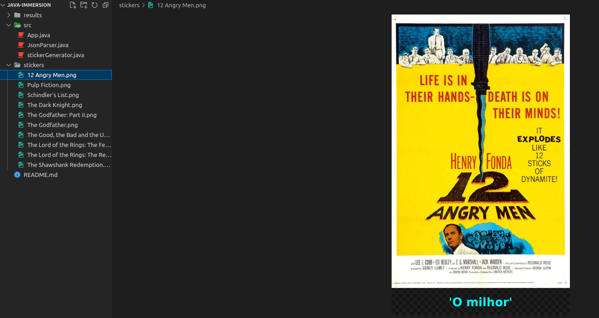

# Immersion in Java ♨

## Class Schedule

:point_right: **Obs: The classes are divided into branches**

- Class 01 - Consuming a Movie API with Java
- Class 02 - Movies Stickers for WhatsApp
- Class 03 - Refactoring and object-orientation
- Class 04 - Creating own API with Spring
- Class 05 - Publishing API in Cloud service

## Class Summary

**Class 1:**

- Calling the IMDB API, in this case I used the JSON that was in github as the IMDB API was unstable to call and pull the JSON data.
- Realized the parsing of the data in the JsonParser
- Top movies are being printed on the terminal with emoji's following the movie rating when executed

**Class 2:**

- Making the Sticker generator using different input streams.
- Setting a new image with text, using the iconic phrase from Cristiano Ronaldo: "Eu sou o 'milhor'" :rofl:
- Creating a output sticker directory if it doesn't exist, refactoring App.java and making new data manipulations.

